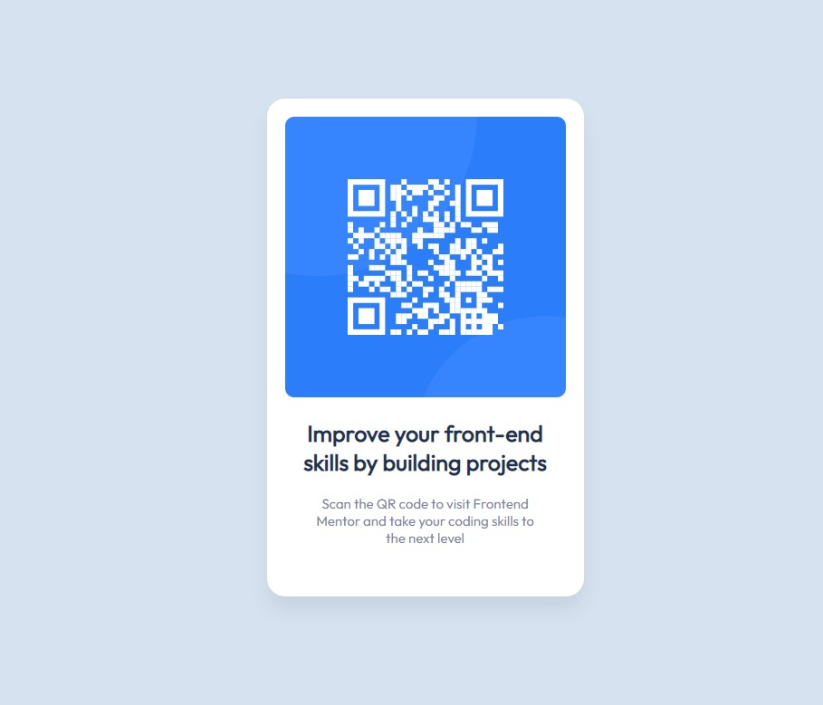

# Frontend Mentor - QR code component solution

This is a solution to the [QR code component challenge on Frontend Mentor](https://www.frontendmentor.io/challenges/qr-code-component-iux_sIO_H). Frontend Mentor challenges help you improve your coding skills by building realistic projects. 

## Table of contents

- [Frontend Mentor - QR code component solution](#frontend-mentor---qr-code-component-solution)
  - [Table of contents](#table-of-contents)
  - [Overview](#overview)
    - [Screenshot](#screenshot)
    - [Links](#links)
  - [My process](#my-process)
    - [Built with](#built-with)
    - [What I learned](#what-i-learned)
    - [Continued development](#continued-development)
  - [Author](#author)
  - [Acknowledgments](#acknowledgments)

**Note: Delete this note and update the table of contents based on what sections you keep.**

## Overview

### Screenshot

### Links

- Solution URL: [Github repository](https://github.com/MoyTV/QR-code-component-challenge-on-Frontend-Mentor)
- Live Site URL: [Github page](https://moytv.github.io/QR-code-component-challenge-on-Frontend-Mentor/)

## My process

### Built with

- Semantic HTML5 markup
- CSS custom properties

### What I learned

Like almost with every project, you can learn something from trying solutions that make sense in your head, but probably is not as easy as you might initially think.

This is my first solution submit, so this is a huge learning step for me.

### Continued development

I want to continue creating real-life-like projects.

## Author

- Frontend Mentor - [@MoyTV](https://www.frontendmentor.io/profile/MoyTV)
- Twitter - [@MoyTV](https://twitter.com/MoyTV)

## Acknowledgments

I want to thank Angela Yu for teaching me web development and spiring me to take this challenges.
